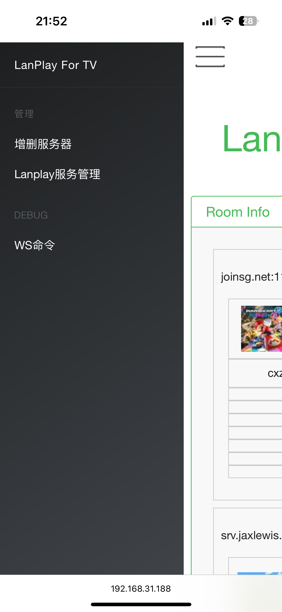

# lanplay_embedded
Provide a lanplay service for embedded devices.
This includes buildroot compilation and the provision of a web management UI of managing server lists and enabling/disabling lanplay services.

## Web UI





## Manual
### Files
| Files 								| Details 							|
| -- | -- |
| /usr/bin/lanplay-server-mgr 			| Simple server manager binary		| 
| /usr/webfiles/tools/LanPlay.html		| Web management UI is used for simple server management. It also supports querying the corresponding room information from the server and communicating with the lanplay service through RPC. |
| /usr/lanplay_server/server_list.txt	| Local server list 				|
## How to use Web UI
### Add/Remove server with Web UI
- Click `Add/Remove server` in sidebar.
### Start/Stop lanplay with Web UI
- Build or copy lanplay binary to your device.
- Start lanplay with RPC. e.g.
```shell
local_ip=`ip addr show | awk '/inet / {print $2}' | cut -d/ -f1`
lanplay --rpc $local_ip:8001 --rpc-token cxz-switch &
```
- Open `LanPlay.html` in your browser. e.g. `http://192.168.31.188:8091/tools/LanPlay.html`
- With `LanPlay Service management`, you can start/stop the relay server via websocket.
- Use `DEBUG -> WS Commands` to communicate with lanplay via RPC.
## Build (for buildroot)
- Clone this repository into your buildroot directory.
```shell
cd buildroot/package
git clone git@github.com:Ken-u/lanplay_embedded.git
```
- Include this module.
```git
diff --git a/package/Config.in b/package/Config.in
index 81464d0d..355bddf6 100644
--- a/package/Config.in
+++ b/package/Config.in
@@ -1486,6 +1486,7 @@ menu "Other"
        source "package/clang/Config.in"
        source "package/clapack/Config.in"
        source "package/classpath/Config.in"
+       source "package/lanplay-server-mgr/Config.in"
        source "package/cppcms/Config.in"
        source "package/cracklib/Config.in"
        source "package/dawgdic/Config.in"
```
- Enable this module for your build.
```git
git diff configs/
diff --git a/configs/rockchip_rk3288_defconfig b/configs/rockchip_rk3288_defconfig
index bcb0995b..8832c868 100644
--- a/configs/rockchip_rk3288_defconfig
+++ b/configs/rockchip_rk3288_defconfig
@@ -36,6 +35,8 @@ BR2_PACKAGE_LIBCURL_CURL=y
 BR2_PACKAGE_LIBNDP=y
 BR2_PACKAGE_KENJC=y
 BR2_PACKAGE_ARIA2=y
+BR2_PACKAGE_LANPLAY=y
+BR2_PACKAGE_LANPLAY_SERVER_MGR=y
 BR2_PACKAGE_PROTOBUF=y
 BR2_PACKAGE_NEWT=y
 BR2_PACKAGE_OPENSSH=y
```
- Build this module.
```shell
make lanplay-server-mgr-reconfigure
```
